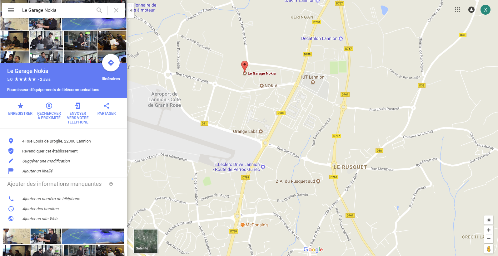

Le Garage will organize an [Hacktoberfest](https://hacktoberfest.digitalocean.com/) summit on the **23rd of October 2018**.

# What's the Hacktoberfest
Hacktoberfest's goal is to promote and support open-source by encouraging new contributors and new contributions in GitHub.


Whether you are a developer or not, a GitHub guru or completely new to it, if you want to contribute to opensource, or learn how to do it, **register now** and join us.
For those who own projects, this would be a great opportunity to find some contributors to help you.

# What will we do ?
Hacktoberfest—brought to you by DigitalOcean and GitHub—is a month-long celebration of open source software. Maintainers are invited to guide would-be contributors towards issues that will help move the project forward, and contributors get the opportunity to give back to both projects they like, and ones they’ve just discovered. Everyone can contribute from documentation update to bug fixes

## Information
### When
  Tuesday 23rd of October from 5:00 PM to 9:00 PM
### Where
```  
  Le Garage Nokia
  22300 LANNION
  FRANCE
```
[](https://www.google.fr/maps/place/Le+Garage+Nokia/@48.7583509,-3.4626582,17.08z/data=!4m5!3m4!1s0x0:0x4d7fd7d8295d212b!8m2!3d48.759098!4d-3.4606525?hl=fr)

### Agenda
Check the [agenda](./agenda)

### Register now
[Sign-up to participate](https://www.eventbrite.fr/e/billets-hacktoberfest-2018-meetup-le-garage-nokia-50774292275)

Don't forget to also Register to [Github Hacktoberfest event](https://hacktoberfest.digitalocean.com/sign_up/register)

### Already Registered ?
Make your first pull request by adding your name to the [list of participants](./participants)

Start browsing all [participating Hacktoberfest projects](https://github.com/search?q=label:hacktoberfest+state:open+type:issue) on GitHub

Check your progress on [Hacktoberfest official site](https://hacktoberfest.digitalocean.com/stats/)

## Projects

You don't know where to start... here are some projects on which you can contribute :

* [Fake Nokia Anthological Snake](https://github.com/ourtigarage/web-snake)
* [Hacktoberfest Leaderboard](https://github.com/ourtigarage/hacktoberfest-leaderboard)

* [Orange Open Source / Oorobot](https://github.com/Orange-OpenSource/oorobot)
* [Orange Open Source / EtherPlant](https://github.com/Orange-OpenSource/EtherPlant)
* [Orange Open Source / EtheRemark](https://github.com/Orange-OpenSource/EtheRemark)
